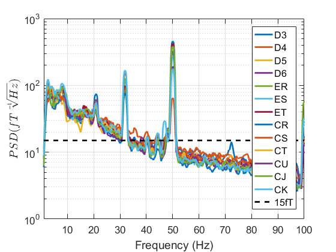
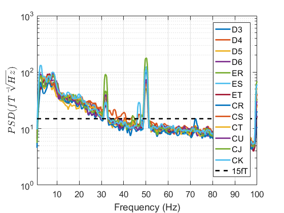
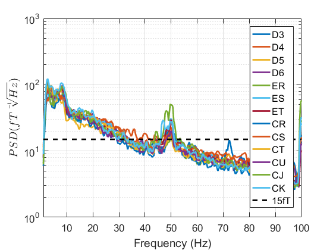
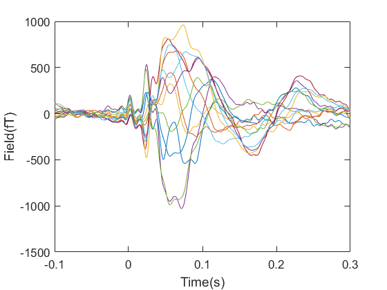

# OPM processing Guide for SPM

The code in this toolbox can be used to create SPM MEEG objects from an arbitrary  data source or to simulate MEG data. The main function used in this toolbox is  `spm_opm_create`. Examples are given of how this function might be used in various contexts.  


## Table of contents
1. [Preliminaries and Warranty](#a)
2. [Data Import](#b)
	1. [Sensor level OPM data](#b1)
	2. [Source level OPM data](#b2)
3. [Preprocessing](#d)
	1. [Filtering](#d1) 
	2. [Power Spectral Density](#dp)
	3. [Synthetic Gradiometry: Wideband](#dw)
	4. [Synthetic Gradiometry: Narrowband](#dn)
	5. [Epoching](#d3)
4. [Sensor Space Analysis](#e)
	1. [Evoked Response](#e1)
5. [A Whole Script](#h)
6. [Simulation](#c)
	1. [MNI space ](#c1)
	2. [Whole head MNI space](#c2)
	3. [Individual Subject](#c3)
	4. [Individual Subject with fixed Sensor Positions](#c4)
	5. [Individual Subject with Custom Cortical Mesh](#c5)	
7. [Contributing Code](#g)


<a name="a"></a>
## Preliminaries and Warranty

For  this code to run you must have [SPM12](http://www.fil.ion.ucl.ac.uk/spm/software/spm12/) added to Matlab's path. To run these examples you will need to run this code snippet. This will add SPM12 and the simulation toolbox to the path. It will also change the directory to the [test data folder](https://github.com/tierneytim/OPM/tree/master/testData).


```matlab
%% Housekeeping
clear all
addpath('spm12')
spm('defaults', 'eeg')
addpath('OPM')
dir = 'OPM\testData';
cd(dir)
```

However, before you run this code you should know that it is licensed under a GNU license which means no warranty or liability. Please read the [License](LICENSE) before use.


<a name="b"></a>
## Data Import


<a name="b1"></a>
### Sensor level OPM data

While OPM data may come in many native formats currently the UCL native file format is a simple binary file that contains the magnetometer output. In order to read this file and assign appropriate labels, units and channel types to the dataset some metadata is required. This should be provided in the form of a channels.tsv and a meg.json file. One also needs to specify the precision of the data  in the `S.precision`(default is 'single' but in this case the data is stored as'double') The metadata files should conform to the standards recommended by  [BIDS](https://bids-specification.readthedocs.io/en/latest/04-modality-specific-files/02-magnetoencephalography.html) specification for MEG. Code to create a dataset suitable for sensor level analysis is given below. The files can be found in the [test data folder](https://github.com/tierneytim/OPM/tree/master/testData).

```matlab
S =[];
S.data = 'meg.bin';
S.channels='channels.tsv';
S.meg='meg.json';
S.precision='double';
D = spm_opm_create(S);
```

### Source level OPM data
To go further than a sensor level analysis more metadata is required. Two files are necessary to achieve this aim. The first is a 'positions.tsv' file. This should give coordinates and orientations of the sensors. The coordinate system of these sensors should be defined in the coordsystem.json file. The format of which is described in [BIDS specification](https://bids-specification.readthedocs.io/en/latest/04-modality-specific-files/02-magnetoencephalography.html) and example file for both of these is available in the [test data folder](https://github.com/tierneytim/OPM/tree/master/testData). Lastly, a structural MRI is required to compute the MEG forward model. Code is given below as an example of how these files can be utilised.

```matlab
S =[];
S.data = 'meg.bin';
S.coordystem='coordsystem.json';
S.positions='positions.tsv';
S.channels='channels.tsv';
S.meg='meg.json';
S.sMRI='T1w.nii';
S.precision='double';
D = spm_opm_create(S);
```


<a name="d"></a>
## Preprocessing

A number of preprocessing steps can be optionally applied to OPM data in any order you want(similar to any MEG dataset). Here is an example of one pipeline.


<a name="d1"></a>
### Filtering

Temporal filtering can be applied to remove the effects of high or low frequency interference. In this case we filter between 1 and 100 Hz using a 2nd order butterworth filter. The following code snippet should filter the data we created in the previous step. 

```matlab
S = [];
S.D = D;
S.type = 'butterworth';
S.band = 'bandpass';
S.freq = [2 100];
S.dir = 'twopass';
S.order = 2;
D = spm_eeg_filter(S);
```
<a name="dp"></a>
### Power Spectral Density
Having filtered the data (or beforehand) it is often useful to examine the Power Spectral Density(PSD) which tells us how  much variance can be attributed to each frequency band. When the PSD is integrated over a specific band it should integrate to the variance of the signal in that band. However, in the neuroimaging literature it is often the square root of the PSD that is reported to assess the variability in a given frequency band. We show an example of how to calculate this with the code below. The most important argument of this function is the `triallength` argument which governs the length of the epochs the spetra are averaged over.  

```matlab
S=[];
S.D=D;
S.triallength=3000;
S.bc=1;
S.channels='MEG';
S.plot=1;
spm_opm_psd(S);
xlim([1, 100])
ylim([1, 1000])
```
<p align="center">

</p>
What  should be clear from the figure is that there are interfering signals at 20Hz, 32Hz and 50Hz. In order to lessen the impact of these interfering signals  we perform synthetic gradiometry. 

<a name="dw"></a>
### Synthetic Gradiometry: Wideband
OPMs are magnetometers and not gradiometers which makes them somewhat more susceptible to environmental interference than gradiometers. To mitigate this effect we construct `Synthetic Gradiometers` by regressing the signal in a set of reference sensors from the signal in the scalp sensors. This can be done on a trial by trial basis or across the whole scanning session. If epoched data is supplied the it will take place on a trial by trial basis.  In this case we will use the whole session data. An example of how you might do this is given below. 


``` matlab
S=[]
S.D=D;
S.confounds={'REF'};
D = spm_opm_synth_gradiometer(S);
```
<p align="center">

</p>
When we plot the PSD of this dataset we notice that while the interfering signals have been reduced in magnitude the 32 Hz and 50Hz peak is still quite noticeable. This is because we have regressed the wideband signal in reference sensors from the data. This will only work will if all the interference comes from one source. To improve upon this result we must do narrowband gradiometry

<a name="dw"></a>
### Synthetic Gradiometry: Narrowband
The implementation of the narrowband gradiometry is similar to wideband gradiometry in that both are linear regression but differ in the regressors used. In the narrowband method filtered versions of the regressors are used instead. If necessary multiple regressors are created by filtering the same regressors to different bands. The code to do this differs only very slightly from the previous code. The main difference is that `S.confounds` has now got multiple entries indicating that these regressors should be filtered to different narrowbands as indicated by `S.lp` and `S.hp`. 

``` matlab
%% denoising
S=[];
S.D=D;
S.lp=[25, 34, 53];
S.hp=[15,30, 47];
S.confounds={'REF','REF','REF'};
D = spm_opm_synth_gradiometer(S);
```

<p align="center">

</p>

This time the PSD looks much cleaner and no longer has the the 20Hz and 32Hz peaks. Unfortunately It couldn't completely correct for the 50Hz peak (even though the magnitude has been reduced by a factor of 10). In these cases for the peaks that can't be corrected for with gradiometry a notch filter might be appropriate.  


As a final note on this function, it is not restricted to selecting channels by type(as has been done here). If reference sensors haven't been marked in the dataset once can select the sensors by name(or by using regular expressions). This should allow for flexible use of this function to regress any confound from the data as long as it is listed as a channel in the `channels.tsv` file. 

``` matlab
%% denoising
chans = {'(CL|CM|CO|CP)','(CL|CM|CO|CP)','(CL|CM|CO|CP)'};
lp =  [25, 34, 53];
hp =  [15, 30, 47];

S=[];
 S.D=fD;
 S.lp=lp;
 S.hp=hp;
 S.confounds=chans;
 dD = spm_opm_synth_gradiometer(S);
```
While this is a bit of a more cumbersome approach it offers a nice degree of flexibility and replicates exactly the results obtained by selecting channels by type. 

<p align="center">

</p>

<a name="d3"></a>
### Epoching

To epoch the data we just need to tell SPM the time windows(in ms) we want to analyze and SPM will extract the data around all triggers in order to epoch the data. In order for this to work there needs to be at least 1 channel in the MEEG object that has the type `TRIG`. 


``` Matlab
S =[];
S.D=D;
S.timewin=[-100 300];
S.condLabels= {'Median Nerve'};
D= spm_opm_epoch_trigger(S);
```


<a name="e"></a>
## Sensor Space Analysis

<a name="e1"></a>
### Evoked Responses

Once the data is preprocessed calculating an evoked response  is easy. It just requires a few lines of code which are given below resulting in a nice pretty picture.


```matlab
S =[]
S.D=D;
D =spm_eeg_average(S);
```
We can also apply a baseline correction to this dataset as well

```matlab
S=[];
S.D=D;
S.timewin=[-100 -20];
D = spm_eeg_bc(S);
```

we can then plot this evoked response with the following bit of code

```matlab
inds = selectchannels(D,'MEG');
figure()
plot(D.time(),bD(inds,:,:)')
xlabel('Time(ms)')
ylabel('Field(fT)')
ax = gca; % current axes
ax.FontSize = 13;
ax.TickLength = [0.02 0.02];
fig= gcf;
fig.Color=[1,1,1];
```

<p align="center">

</p>


<a name="h"></a>
## An example script

Here we put all the steps together into 1 script for you to try out.

```matlab
%% Housekeeping
clear all
dir = 'OPM\testData';
cd(dir)

%% read data
S =[];
S.data = 'meg.bin';
S.sMRI='T1w.nii';
S.precision='double';
D = spm_opm_create(S);

%% filter the data
S = [];
S.D = D;
S.type = 'butterworth';
S.band = 'bandpass';
S.freq = [2 100];
S.dir = 'twopass';
S.order = 5;
fD = spm_eeg_filter(S);

%% PSD
S=[];
S.D=fD;
S.triallength=3000;
S.bc=1;
S.channels='MEG';
S.plot=1;
spm_opm_psd(S);
xlim([1, 100])
ylim([1, 1000])

%% denoising
S=[];
S.D=fD;
S.lp=[25, 34, 53];
S.hp=[15,30, 47];
S.confounds={'REF','REF','REF'};
d2D = spm_opm_synth_gradiometer(S);

%% PSD
S=[];
S.D=d2D;
S.triallength=3000;
S.bc=1;
S.channels='MEG';
S.plot=1;
spm_opm_psd(S);
xlim([1, 100])
ylim([1, 1000])

%% epoch the data
S =[];
S.D=d2D;
S.timewin=[-100 300];
eD= spm_opm_epoch_trigger(S);

%% Average
S =[];
S.D=eD;
mD =spm_eeg_average(S);

%% baseline correct
S=[];
S.D=mD;
S.timewin=[-100 -20];
bD = spm_eeg_bc(S);

%% plot 
inds = selectchannels(bD,'MEG');
figure()
plot(bD.time(),bD(inds,:,:)')
xlabel('Time(s)')
ylabel('Field(fT)')
ax = gca; % current axes
ax.FontSize = 13;
ax.TickLength = [0.02 0.02];
fig= gcf;
fig.Color=[1,1,1];


%% delete
delete(D)
delete(fD)
delete(dD)
delete(eD)
delete(mD)
delete(bD)
```

<a name="c"></a>
## Simulation


<a name="c1"></a>
### MNI Space
If you want to simulate MEG data you need to supply sensor positions and  orientations which should be in the same coordinate space as some brain image. If you don not have a brain image or sensor positions(and orientations) you can simulate data on an average template brain with automatically generated positions of fixed spacing using `spm_opm_create`. The following code snippet automatically generates sensors in this average space that are a fixed `space` apart. In this case the spacing is 15mm.

```matlab
S =[];  
S.space = 15;  
D = spm_opm_create(S);  
```
Once you run this code you will generate a figure like this. 

<p align="center">

</p>


<a name="c2"></a>
### Whole-Head MNI space
For some simulations you may want the entire scalp surface to be covered. In this case you just need to set the `wholehead` flag to 1.
```matlab
S =[];
S.space = 15;
S.wholehead=1;
D = spm_opm_create(S);
```
Running this code snippet should generate a figure like this.

<p align="center">

</p>

<a name="c3"></a>
### Individual Subject
In some cases you may have already have an individual brain image that you want to simulate data in but no positions or orientations. In this case you just need  to give your desired sensor spacing with the `space` argument and the filepath to an MRI file with the `sMRI` argument. The slightly different orientation of this brain is due to the fact that this brain is not in the MNI space.

```matlab
S =[];
S.space = 15;
S.sMRI= 'T1w.nii;
D = spm_opm_create(S);
```

<p align="center">

</p>

<a name="c4"></a>
### Individual subject with fixed sensor positions
If you already have positions and orientations for a certain brain image this can be accounted for as well. This information can be supplied in the form of a tab-delimited text file where the first six columns give position and orientation(x,y,z,x,y,z) and the final column gives a label for the sensor. 
The code to incorporate this information just requires to specify the `pos argument 

```matlab
S =[];
S.positions='positions.tsv';
S.sMRI= 'T1w.nii';
D = spm_opm_create(S);
```
<p align="center">

</p>

<a name="c5"></a>
### Individual Subject with Custom Cortical Mesh
Other times you may not wish to use the default meshes supplied by SPM and may wish to provide custom meshes. This is easily done with the `cortex` argument. Any mesh can be supplied but it is up to the user to ensure the meshes are in the same coordinate  space.
 ```matlab
S =[];
S.space = 15;
S.cortex='testCustom.gii';
S.sMRI= 'T1w.nii';
D = spm_opm_create(S);

```

<p align="center">

<p>

<a name="g"></a>
## Contributing Code
Contributions are always welcome. However, there are a few general rules that should be 
followed if you want to contribute code. 

- Main functions should begin with `spm_opm`. 
- They should accept one argument: `S`. 
- All arguments must be described in a help section within the file.  
- The default values should be clearly identified. 
- The use of `nargin` and  `varargin` are strictly forbidden. 
- The return value should usually be an MEEG object called `D` 
- A copy & paste example must be provided 
- No line of code should be longer than 75 columns(characters) in Matlab. 

For helper functions all these rules can be relaxed bar the use of `nargin`, `varargin` 
and the 
number of characters per line of code.
