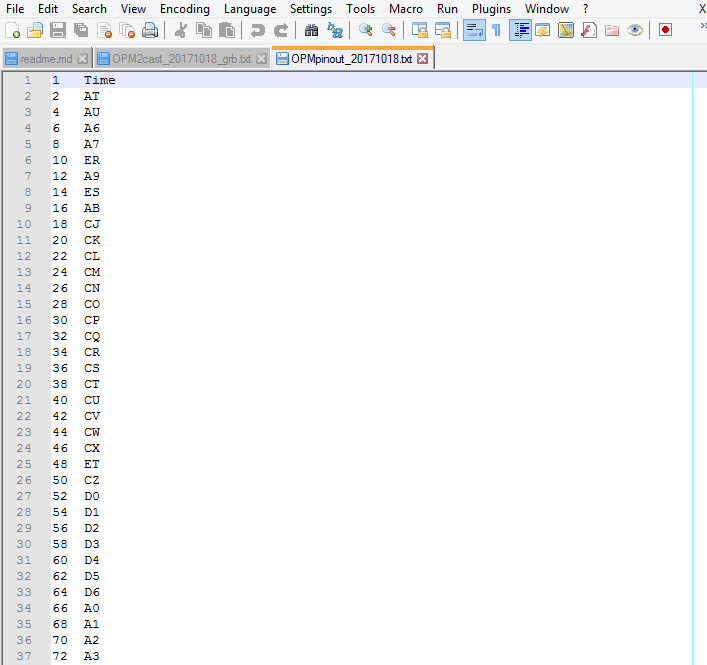
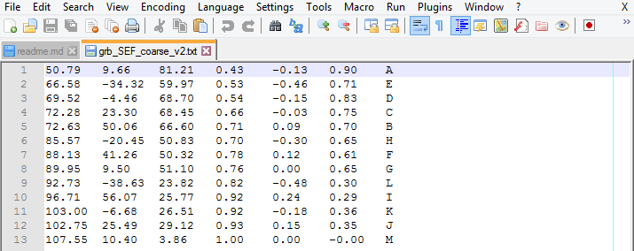
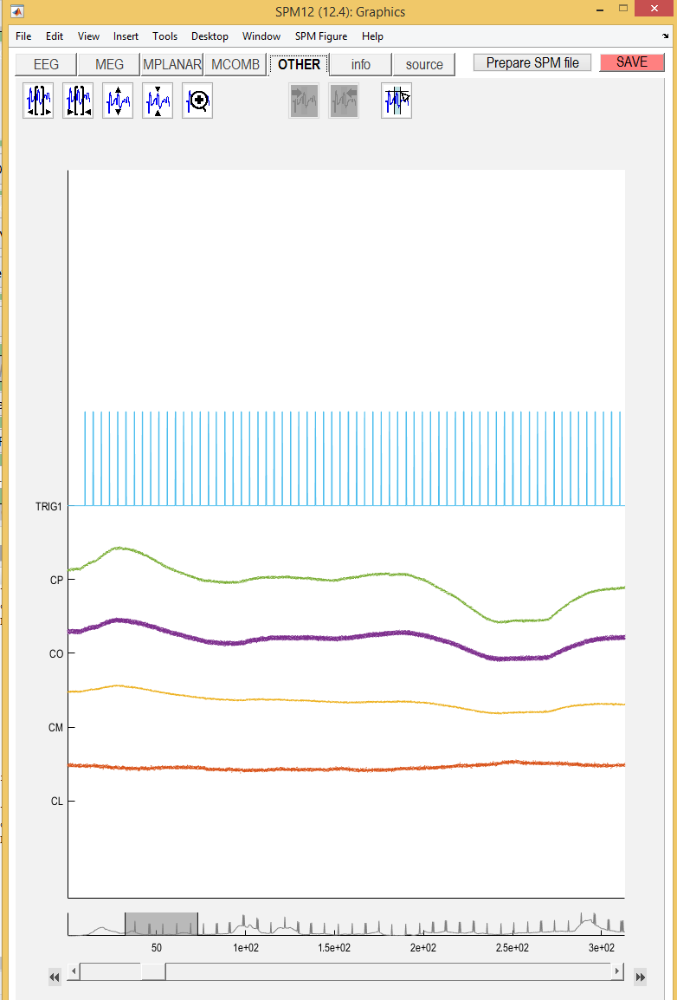
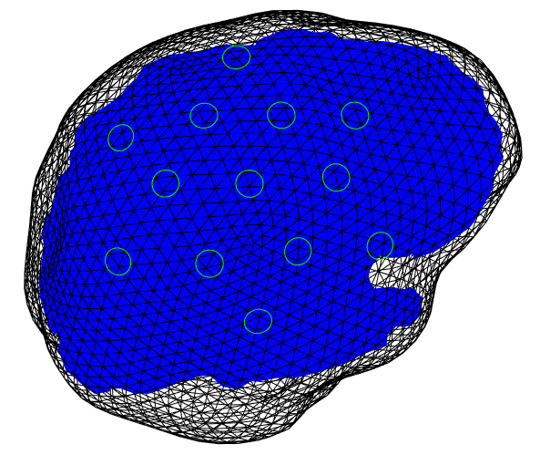
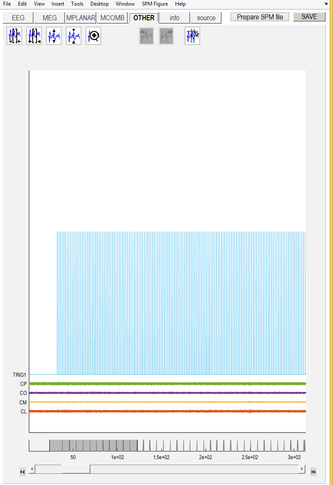
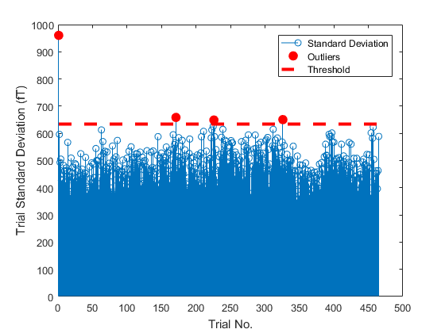
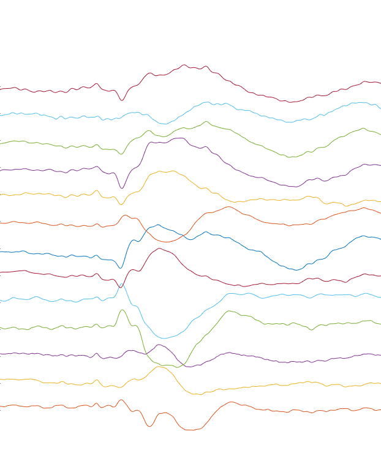
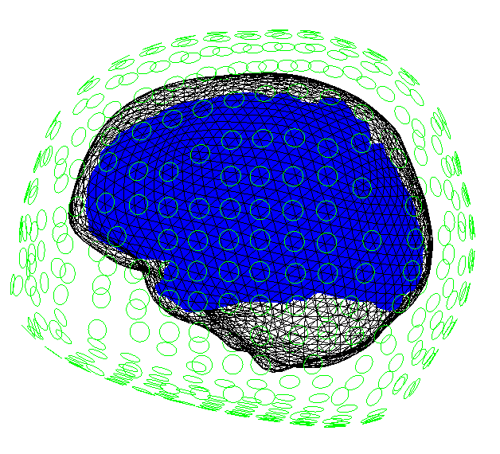
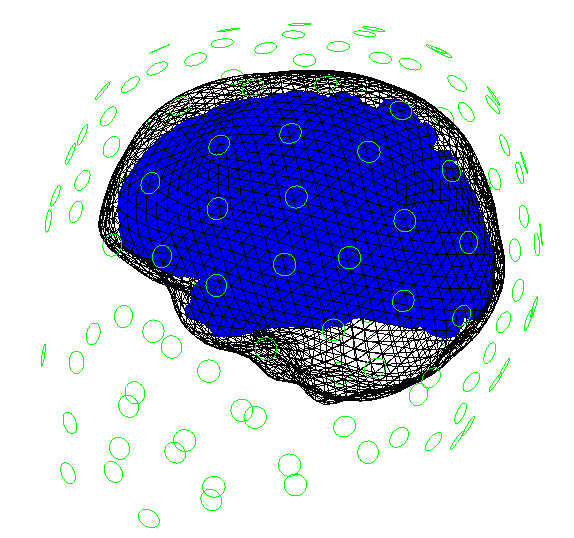
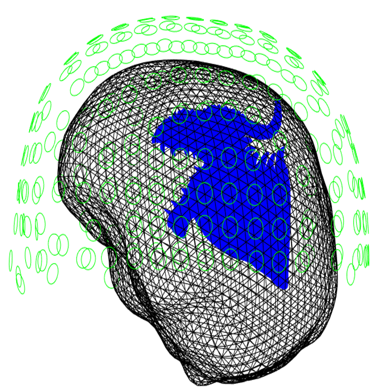

# OPM processing Guide for SPM

The code in this toolbox can be used to create SPM MEEG objects from an arbitrary  data source or to simulate MEG data. The main function used in this toolbox is  `spm_opm_create`. Examples are given of how this function might be used in various contexts.  


## Table of contents
1. [Preliminaries and Warranty](#a)
2. [Data Import](#b)
	1. [Reading Labview Files](#b1)
	2. [Converting Raw Data](#b2)
	3. [Incorporating Triggers](#b3)
	4. [Other Settings](#b4)
3. [Preprocessing](#d)
	1. [Filtering](#d1)
	2. [Epoching](#d2)
	3. [Synthetic Gradiometry](#d3)
	4. [Detect Outlier Trials](#d4)
4. [Sensor Space Analysis](#e)
	1. [Evoked Response](#e1)
	2. [Time Frequency Analysis](#e2)
	3. [Bootstrapping Responses](#e3)
5. [Source Space Analysis](#f)
	1. [Dipole Fitting](#f1)
	2. [Distributed Source Inversion on a Mesh](#f2)
	3. [Distributed Source Inversion in a Volume](#f3)
6. [A Whole Script](#h)
7. [Simulation](#c)
	1. [MNI space ](#c1)
	2. [Whole head MNI space](#c2)
	3. [Individual Subject](#c3)
	4. [Individual Subject with fixed Sensor Positions](#c4)
	5. [Individual Subject with Custom Cortical Mesh](#c5)	
8. [Contributing Code](#g)


<a name="a"></a>
## Preliminaries and Warranty

For  this code to run you must have [SPM12](http://www.fil.ion.ucl.ac.uk/spm/software/spm12/) added to Matlab's path. To run these examples you will need to run this code snippet. This will add SPM12 and the simulation toolbox to the path. It will also change the directory to the test data folder.


```matlab
%% Housekeeping
clear all
addpath('spm12')
spm('defaults', 'eeg')
addpath('OPM')
dir = 'OPM\testData';
cd(dir)
```

However, before you run this code you should know that it is licensed under a GNU license which means no warranty or liability. Please read the [License](LICENSE) before use.


<a name="b"></a>
## Data Import


<a name="b1"></a>
### Reading Labview Files 

While OPM data may come in many native formats currently the UCL/UoN native file format is a `labview text file` format. As such a helper funciton to read these Labview files is provided. If any other file format is used the user needs to write a read function that will read this file into a matrix in Matlab. The function has a number of arguments that need to be changed depending on the file format.  The `S.nchannels` argument specifies the number of columns in the `labview file`. The `S.headerlength` argument specifies the the number of lines of text that contain header information. The `S.timeind` argument specifies the index of the time variable. If there is no time variable set this value as 0. Triggers embedded in the labview file can be interpreted in 2 ways. the triggers can be interpreted as binary in which case the channels identified by `S.binaryTriggerInds` are simply thresholded using `S.trigThresh` and returned in the `lbv` object. The other option is to interpret the triggers identified by `S.decimalTriggerInds` as decimal. This means that the function will attempt to combine these triggers in such a way to allow for values other than 1 or 0. One final point to note is that this function natively accepts `.lvm` files or zipped `.lvm` files. Running the code snippet bellow will return  a labview struct: `lbv` which contains all data and triggers. 

```matlab
S = [];
S.filename= 'QZFM_6.zip';
S.nchannels=81;
S.trigThresh=4;
S.decimalTriggerInds=74:81;
S.binaryTriggerInds=[];
S.timeind=1;
lbv = spm_opm_read_lvm(S);
```


<a name="b2"></a>
### Converting Raw Data


The simplest way to create an MEG object is to supply data in a matrix form to the function `spm_opm_create`. However, there is a lot of metadata that needs to be supplied in order to create a fully compliant SPM MEEG object. In the first instance we need to know what channels are contained in the `lbv.B` matrix. This is indicated by the use of a `pinout` file which is a  `tab delimted.txt file`. This file is supplied as an argument to `spm_opm_create`. This file  contains the labels of the OPM sensors in the second column and the column number of the `lbv.B` matrix in which this data are stored in the first column. A properly formatted `pinout` file should look like this when viewed in a text editor.


<p align="center">

</p>


To locate the source of the neural activity we need to know where these sensors are relative to the brain. The way we have addressed this issue is by creating custom made helmets to house our sensors. We know exactly where these sensor slots are relative to the brain because we created these helmets using MRI images. An example of one of these helmets is given below. 


<p align="center">

</p>

The way we get this information into SPM is by using another another `tab delimted .txt file` which is also suppled to `spm_opm_create` as an argument. This file contains 7 Columns. The first six columns provide position(x,y,z) and orientation(x,y,z) Information in the world space of some brain image. The last column gives the label of each individual slot. This text file should look something like this when properly formatted.


<p align="center">

</p>


However, in some cases not all the data is usable. For instance the `lbv.B` variable contains data from 36 OPM sensors measuring both radially and tangentially to the head and 8 trigger channels (36x2+8=80). For this experiment we only recorded data from 13 sensors measuring radially to the head along with four reference sensors. Therefore, we only need to extract 17 columns from the `B` matrix. However to do this we need to know the labels of the sensors we used and also their position relative to the brain. 


The  file used to accomplish this is also a `tab delimted.txt file`. This file  serves three purposes. The first is that it tells us which of the sensors were used. This information is stored in the first column. This information can then be mapped to the `S.pinout` file to only select the desired sensors. The second column of this files tells us two things. The first is which sensors are reference sensors. This should be indicated by placing the label `REF` next to a reference sensor. The final purpose of this column are to tell us where the sensors are. This is done by placing the corresponding label from the position file next to a sensor. A properly formatted file should look like this.


<p align="center">

</p>


If all three of these files are suppled to `spm_opm_create` when you run the following code snippet you should get  a full formatted SPM MEEG object with 17 channels. Note that the the first text file gets supplied to `S.pinout`, the second to `S.pos` and the third to `S.sensorsUsed`. Also in this example the data needs to be transposed as SPM accepts data in the format (channels,time,trials) where as labview outputs in the form (time,channels) Also we must supply the structural MRI file from which the sensor positions were created.


```matlab
S =[];
S.data = lbv.B';
S.pinout= 'OPMpinout_20171018';
S.pos = 'SEF_coarse';
S.sensorsUsed='OPM2cast_MedianNerve';
S.sMRI= 'msMQ0484_orig.img';
D = spm_opm_create(S);
```

<a name="b3"></a>
### Incorporating Triggers


While the previous code snippet  allowed for the creation of SPM MEEG objects it did not show how to handle events of interest. This can be done by taking advantage of the `S.trig` argument in `spm_opm_create`. By way of example the `lbv.deciamlTrigs` matrix contains 1 trigger channel. This can be supplied to `spm_opm_create` This  can be seen in the following code snippet.


``` matlab
S =[];
S.data = lbv.B';
S.trig = lbv.decimalTrigs';
S.pinout= 'OPMpinout_20171018';
S.pos = 'SEF_coarse';
S.sensorsUsed='OPM2cast_MedianNerve';
S.sMRI= 'msMQ0484_orig.img';
D = spm_opm_create(S);
```


By default `spm_opm_create` labels these triggers as `TRIG1`, `TRIG2`, `TRIG3`... and this can be verified by using the display feature from the `SPM` GUI, selecting the dataset and looking at the `OTHER` tab.

<p align="center">

</p>


<a name="b4"></a>
### Other Settings
There are some other settings of `spm_opm_create` that are important for data import. These include specifying the sampling frequency: `S.fs` and the scale factor: `S.scale`. The scale factor is the factor by which the MEG data is muliplied by to convert to units of `fT`

```matlab
S =[];
S.data = B';
S.trig = trig';
S.fs =1000;
S.scale = 1e6/2.7;
S.pinout= 'OPMpinout_20171018';
S.sensorsUsed='OPM2cast_20171018_grb';
S.pos = 'grb_SEF_coarse_v2';
S.sMRI= 'msMQ0484_orig.img';
D = spm_opm_create(S);
```

Running the previous code snippet should generate a SPM MEEG object that we can run source localization on.  The output of this code snippet should look something like this.


<p align="center">

</p>

 
<a name="d"></a>
## Preprocessing

A number of preprocessing steps can be optionally applied to OPM data in any order you want. Here is an example of one pipeline.


<a name="d1"></a>
### Filtering

Temporal filtering can be applied to remove the effects of high or low frequency interference. In this case we filter between 1 and 80 Hz using a 2nd order butterworth filter. The following code snippet should filter the data we created in the previous step. Note this will filter both the reference sensors and the measurement sensors but not the trigger channels.


```matlab
S = [];
S.D = D;
S.type = 'butterworth';
S.band = 'bandpass';
S.freq = [1 80];
S.dir = 'twopass';
S.order = 2;
D = spm_eeg_filter(S);
```

We can verify this by once again looking  at SPM display and highlighting hte `OTHER` tab

<p align="center">

</p>

<a name="d2"></a>
### Epoching

To epoch the data we just need to tell SPM the time windows(in ms) we want to analyze and SPM will extract the data around all triggers in order to epoch the data. In order for this to work there needs to be at least 1 channel in the MEEG object that has the type `TRIG`. If you import triggers using `spm_opm_create` this will be the case. 


``` Matlab
S =[];
S.D=D;
S.timewin=[-100 300];
S.condLabels= {'Median Nerve'};
D= spm_opm_epochTrigger(S);
```

<a name="d3"></a>
### Synthetic Gradiometry


OPMs are magnetometers and not gradiometers which makes them somewhat more susceptible to environmental interference than gradiometers. To mitigate this effect we construct `Synthetic Gradiometers` by regressing the signal in the reference sensors from the signal in the scalp sensors. This can be done on a trial by trial basis or across the whole scanning session. If epoched data is supplied the it will take place on a trial by trial basis.  An example of how you might do this is given below. 


``` matlab
S=[]
S.D=D;
S.confounds={'REF'};
D = spm_opm_denoise(S);
```

Crucially this function works in an object oriented fashion. The S.confounds argument searches for channel types that with the corresponding label and models these channels as effects of no interest. This framework should therefore be easily extended to include motion estimate from optical tracking cameras simply by changing the S.confounds variable. 


<a name="d4"></a>
### Detect Outlier Trials

Unfortunately,even after performing the synthetic gradiometry there still may be some effects of interference in the data. These effects may make some trials unusable so we provide code to identify and remove outlier trials. 


```matlab
S=[];
S.D=dD;
S.thresh=3;
D = spm_opm_removeOutlierTrials(S);
```

The above code snippet will remove trials marked as outliers and produce a figure to indicate which trials have been removed.


<p align="center">

</p>

<a name="e"></a>
## Sensor Space Analysis

<a name="e1"></a>
### Evoked Responses

Once the data is preprocessed calculating a nevoked response  is easy. It just requires a few lines of code which are given below resulting in a nice pretty picture.


```matlab
S =[]
S.D=D;
D =spm_eeg_average(S);
```

<p align="center">

</p>

<a name="f"></a>
## Source Space Analysis

<a name="h"></a>
## A whole Script

``` 

%% Housekeeping
clear all
addpath('C:\Users\ttierney\Documents\spm12')
spm('defaults', 'eeg')
addpath('D:\toolboxes\SensorPlacement')
dir = 'D:\toolboxes\SensorPlacement\testData';
cd(dir)

%% Reading labview
S = [];
S.filename= 'QZFM_6.lvm';
S.nchannels=81;
S.headerlength=23;
S.timeind=1;
[B, time]= spm_opm_read_lvm(S);

%% raw data with labels, triggers and sensor positions
trig = B(:,77);
S =[];
S.data = B';
S.trig = trig';
S.fs =1000;
S.pinout= 'OPMpinout_20171018';
S.sensorsUsed='OPM2cast_20171018_grb';
S.pos = 'grb_SEF_coarse_v2';
S.sMRI= 'msMQ0484_orig.img';
D = spm_opm_create(S);

%% filter the data
S = [];
S.D = D;
S.type = 'butterworth';
S.band = 'bandpass';
S.freq = [1 80];
S.dir = 'twopass';
S.order = 2;
D = spm_eeg_filter(S);

%% epoch the data
S =[];
S.D=D;
S.timewin=[-100 300];
S.condLabels= {'Median Nerve'};
D= spm_opm_epochTrigger(S);

%% denoising
S=[]
S.D=D;
S.confounds={'REF'};
D = spm_opm_denoise(S);

%% Detecting outlier Trials
S=[];
S.D=D;
S.thresh=3;
D = spm_opm_removeOutlierTrials(S);


%% average the data
S =[]
S.D=D;
md =spm_eeg_average(S);
```

<a name="c"></a>
## Simulation


### MNI Space
If you want to simulate MEG data you need to supply sensor positions and 
orientations which should be in the same coordinate space as some brain image.
If you don not have a brain image or sensor positions and orientations 
you can simulate data in an average template with automattically generated positions
of fixed spacingusing `spm_opm_create`. The following code snippet automatically 
generates sensors in this average space that are a fixed `space` apart. 
In this case the spacing is 15mm.
```matlab
S =[];  
S.space = 15;  
D = spm_opm_create(S);  
```
Once you run this code you will generate a figure like this. 

<p align="center">

</p>


### Whole-Head MNI space
For some simulations you may want the entire scalp surface to be covered. In this
case you just need to set the `wholehead` flag to 1.
```matlab
S =[];
S.space = 15;
S.wholehead=1;
D = spm_opm_create(S);
```
Running this code snippet should generate a figure like this.

<p align="center">

</p>


### Individual Subject
In some cases you may have already have an individual brain image that you want 
to simulate data in but no positions or orientations. In this case you just need 
to give your desired sensor spacing with the `space` argument and the filepath to
an MRI file with the `sMRI` argument. The slightly different orientation of this 
brain is due to the fact that this brain is not in the MNI space.

```matlab
S =[];
S.space = 25;
S.sMRI= 'rsMQ02589-0008-00001-000224-01.nii';
D = spm_opm_create(S);
```

<p align="center">

</p>

### Individual subject with fixed sensor positions
If you already have positions and orientations for a certain brain image this can 
be accounted for as well. This information can be supplied in hte form of a  tab-delimited
text file where the first six columns give position and orientation(x,y,z,x,y,z) 
and the final column gives a label for the sensor. The text file should look something 
like this when opened in a text editor.

<p align="center">

</p>

The code to incorporate this information just requires to specify the `pos` argument 

```matlab
S =[];
S.pos = 'SB_headcast';
S.sMRI= 'rsMQ02589-0008-00001-000224-01.nii';
D = spm_opm_create(S);
```
<p align="center">

</p>


### Individual Subject with Custom Cortical Mesh
Other times you may not wish to use the default meshes supplied by SPM and may wish
to provide custom meshes. This is easily done with the `cortex` argument. Any mesh
can be supplied but it is up to the user to ensure the meshes are in the same coordiante 
space.
 ```matlab
S =[];
S.space = 25;
S.cortex='testCustom.gii';
S.sMRI= 'rsMQ02589-0008-00001-000224-01.nii';
D = spm_opm_create(S);
```

<p align="center">

<p>

<a name="g"></a>
## Contributing Code
Contributions are always welcome. However, there are a few general rules that should be 
followed if you want to contribute code. 

- Main functions should begin with `spm_opm`. 
- They should accept one argument: `S`. 
- All arguments must be described in a help section within the file.  
- The default values should be clearly identified. 
- The use of `nargin` and  `varargin` are strictly forbidden. 
- The return value should usually be an MEEG object called `D` 
- A copy & paste example must be provided 
- No line of code should be longer than 75 columns(characters) in Matlab. 

For helper functions all these rules can be relaxed bar the use of `nargin`, `varargin` 
and the 
number of characters per line of code.
